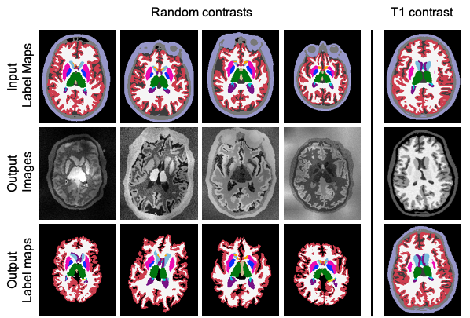

# lab2im

We provide here a generative model that synthesises images by sampling a Gaussian Mixture Model (GMM) conditioned on 
label maps. For each image, the GMM parameters are sampled from prior distributions of predefined hyperparameters, thus
leading to differences in contrast for all synthesied images.

Aditionally to sampling the GMM, data augmentation is performed during the generation 
process. This includes spatial deformation of the label maps, random cropping, random blurring, and intensity
augmentation steps such as bias field corruption, and gamma augmentation.

Importantly, we provide all the steps of the generative model as separate functions, so that user can easily build their
own model. A more complete example of how to use these functions can be found at: https://github.com/BBillot/SynthSeg.

The model is implemented in keras with a tensorflow backend, and relies on the 
[neuron](https://github.com/adalca/neuron) package [1,2].

\
The following figure shows synthetic brain MRI scans generated whith lab2im. It also illustrates the effect of using 
prior distributions when sampling the GMM parameters.
\
\


----------------

### Try it in two lines !

```
from lab2im.image_generator import ImageGenerator

brain_generator = ImageGenerator("./data_example/brain_label_map.nii.gz")
im, lab = brain_generator.generate_image()
```

----------------

### Content

- [lab2im](lab2im): this is the main folder containing the lab2im model and separate functions to manipulate tensors:

  - [lab2im_model](lab2im/lab2im_model.py): contains the generative model `lab2im_model`.
  
  - [image_generator](lab2im/image_generator.py): contains the class `ImageGenerator` a wrapper around lab2im_model. 
  One can simply generate new images by instantiating an object of this class, and call the method `generate_image()`.
  
  - [sample_gmm](lab2im/sample_gmm.py): contains the function `sample_gmm_conditioned_on_labels` to sample a GMM of 
  defined parameters conditionally on a label map.
  
  - [spatial_augmentations](lab2im/spatial_augmentation.py): contains functions to spatially augment the input label
  maps, such as `deform_tensor` for linear and elastic deformation, `random_cropping`, or `label_map_random_flipping`.
  
  - [intensity_augmentation](lab2im/intensity_augmentation.py): functions to perform intensity data augmentation such
  as `bias_field_augmentation`, `gamma_augmentation`, and `min_max_normalisation`.
   
  - [edit_tensors](lab2im/edit_tensors.py): contains several types of functions to edit keras/tensorflow tensors.
  It notably has the blurring function `blur_tensor` along with `get_gaussian_1d_kernels`, which enables to create 
  blurring kernels as tensors. It also has a function `resample_tensor` to resample a tensor to the desired resolution.
  
  - [edit_volumes](lab2im/edit_volumes.py): contains numerous functions to preprocess volumes and label maps (given as 
  numpy array, not tensors!), such as masking, cropping, resampling, smoothing,... These functions are classified by 
  volume type (volumes/label maps), and by input type (numpy arrays/ paths to volumes). 
  
  - [utils](lab2im/utils.py): contains all the utility functions used in this repository.
  
- [scripts](/scripts): simples scripts explaining how to easily generate images. Start with 
[simple_example](scripts/simple_example.py) which shows how to generate images in 2 lines. Then have a look at
[brain_generator](scripts/brain_generator.py) that introduces some functionalities of 
`ImageGenerator`. Finally, [t1w_generator](scripts/t1w_generator.py) examplifies how to use impose prior distributions 
to the GMM in order to sample image of desired intensity distributions.

- ext: contains modules, especially the modified version of *neuron*


----------------

### Requirements

All the requirements are listed in requirements.txt. We list here the important dependencies:

- tensorflow-gpu 2.0
- tensorflow_probability 0.8
- keras > 2.0
- cuda 10.0 (required by tensorflow)
- cudnn 7.0
- nibabel
- numpy, scipy, sklearn, tqdm, pillow, matplotlib, ipython, ...

Because some changes were made compared to the current version of *neuron*, the package is already included in this
repository.


----------------

### Citation/Contact

If you use this code, please cite the following paper:

**A Learning Strategy for Contrast-agnostic MRI Segmentation** \
Benjamin Billot, Douglas Greve, Koen Van Leemput, Bruce Fischl, Juan Eugenio Iglesias*, Adrian V. Dalca* \
*contributed equally \
accepted for MIDL 2020 \
[ [arxiv](https://arxiv.org/abs/2003.01995) | [bibtex](bibtex.txt) ]

If you have any question regarding the usage of this code, or any suggestions to improve it you can contact me at:
benjamin.billot.18@ucl.ac.uk


----------------

###References

[1] *Anatomical Priors in Convolutional Networks for Unsupervised Biomedical Segmentation* \
Adrian V. Dalca, John Guttag, Mert R. Sabuncu, 2018

[2] *Unsupervised Data Imputation via Variational Inference of Deep Subspaces* \
Adrian V. Dalca, John Guttag, Mert R. Sabuncu, 2019